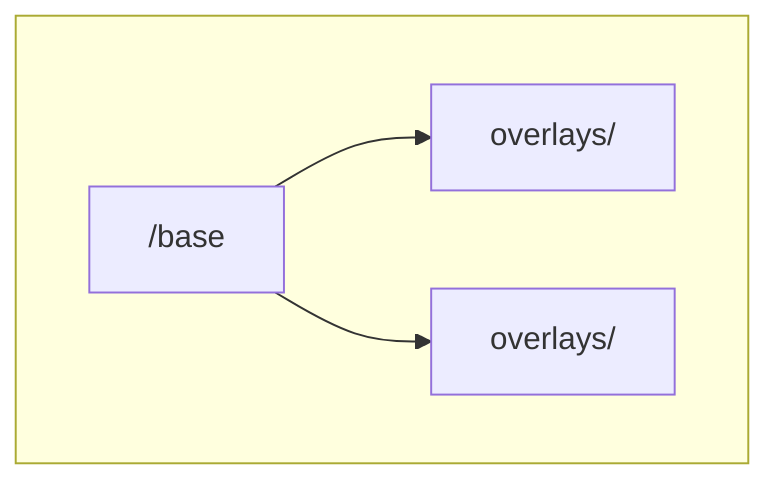
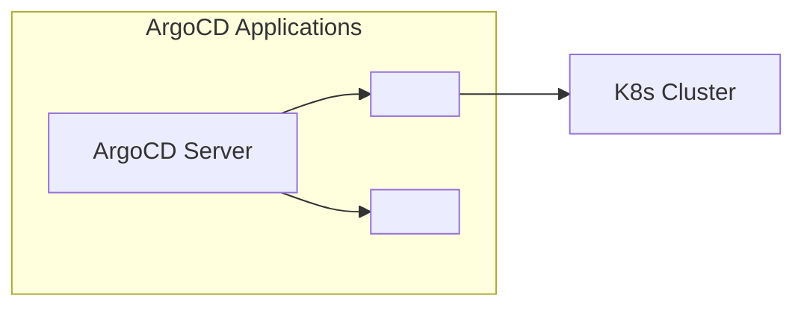
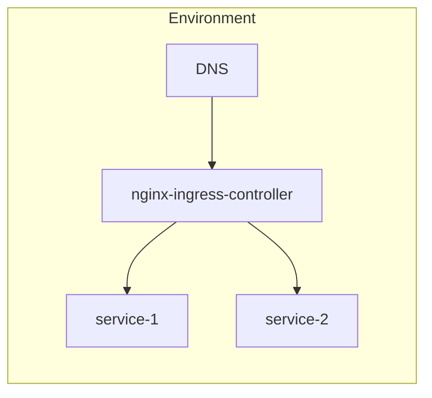
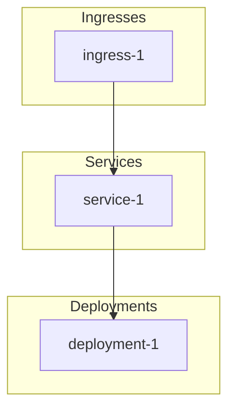

# diagram — Architecture Diagram Generation Skill

Generates architecture diagrams from the live repository structure using Mermaid, D2, or KubeDiagrams.

## Usage

```
diagram                    # Mermaid, all diagram types
diagram mermaid            # Mermaid diagrams
diagram mermaid kustomize  # Mermaid kustomize tree only
diagram d2                 # D2 diagrams
diagram auto               # KubeDiagrams from rendered manifests
diagram mermaid all        # All Mermaid diagram types
```

## Arguments

$ARGUMENTS — Optional: renderer (`mermaid`/`d2`/`auto`), diagram type (`kustomize`/`argocd`/`ingress`/`topology`/`all`). Default: `mermaid all`.

## Instructions

### Step 0: Discover Repository Structure

- **Discover Kustomize modules** by finding directories that contain a `base/` and `overlays/` subdirectory structure
- **Discover environments** by listing subdirectories under each module's `overlays/` directory
- **Discover ArgoCD app manifests** by finding YAML files in `*/argocd/` directories
- Use discovered modules and environments to dynamically build all diagrams

### Mermaid Mode (default)

Generate Mermaid diagrams that render natively in GitLab, GitHub, and most markdown viewers.

#### Type 1: Kustomize Dependency Tree

Parse all `kustomization.yaml` files across discovered modules and generate:



Repeat for each discovered module. Include resource counts per node (e.g., "base (23 resources)").

#### Type 2: ArgoCD Application Graph

Parse all `*/argocd/*.yaml` files and generate:



Build dynamically from discovered ArgoCD application manifests.

#### Type 3: Ingress Routing Map

Parse ingress resources from rendered manifests and generate:



Build dynamically for each discovered environment.

#### Type 4: K8s Resource Topology

Build rendered manifests and group by kind:



### D2 Mode

Generate D2 diagram source files for richer styling.

#### Full Cluster Architecture

```d2
direction: right

argocd: ArgoCD {
  server: Server
}

env1: <env1> Cluster {
  svc1: Service 1
}

argocd.server -> env1
```

Build dynamically from discovered modules, environments, and ArgoCD apps.

Save to `docs/diagrams/<name>.d2`.

Render if d2 is installed: `d2 docs/diagrams/<name>.d2 docs/diagrams/<name>.svg`

### Auto Mode (KubeDiagrams)

Generate diagrams directly from rendered manifests:

```bash
kustomize build <module>/overlays/<env> | kube-diagrams -o docs/diagrams/<env>-topology.png
```

Run for each discovered module/environment combination.

If `kube-diagrams` is not installed, suggest: `pip install KubeDiagrams`

### Output

All diagrams saved to `docs/diagrams/`:
- `kustomize-tree.md` (Mermaid source)
- `argocd-topology.md` (Mermaid source)
- `ingress-map.md` (Mermaid source)
- `k8s-topology-<env>.md` (Mermaid source)
- `*.d2` (D2 source)
- `*.png` / `*.svg` (rendered images, if tools available)

### Rendering (optional)

If `mmdc` (mermaid-cli) is installed:
```bash
mmdc -i docs/diagrams/kustomize-tree.md -o docs/diagrams/kustomize-tree.png
```

If not installed, suggest: `npm install -g @mermaid-js/mermaid-cli`

### Graceful Degradation

- Mermaid mode requires no external tools -- Mermaid source is plain text and renders natively in GitLab/GitHub
- D2 mode: if `d2` is not installed, suggest: `brew install d2` and generate D2 source files anyway (they can be rendered later)
- Auto mode: if `kube-diagrams` is not installed, suggest: `pip install KubeDiagrams` and fall back to Mermaid mode
- If `kustomize` is not installed (needed for topology diagrams), suggest: `brew install kustomize` and skip topology diagram
- If `mmdc` is not installed, skip PNG rendering -- the Mermaid source files are still useful on their own
- Never block the entire diagram generation because one renderer is missing

### Summary

```
Diagrams Generated

| Diagram | Format | File | Rendered? |
|---------|--------|------|-----------|
| Kustomize Tree | Mermaid | docs/diagrams/kustomize-tree.md | PNG (if mmdc) |
| ArgoCD Topology | Mermaid | docs/diagrams/argocd-topology.md | PNG (if mmdc) |
| Ingress Map | Mermaid | docs/diagrams/ingress-map.md | PNG (if mmdc) |
| K8s Topology (<env>) | Mermaid | docs/diagrams/k8s-topology-<env>.md | PNG (if mmdc) |

Output directory: docs/diagrams/
```
