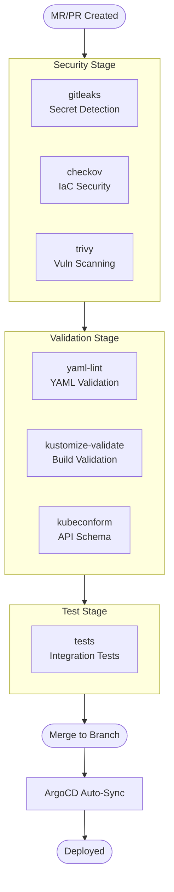
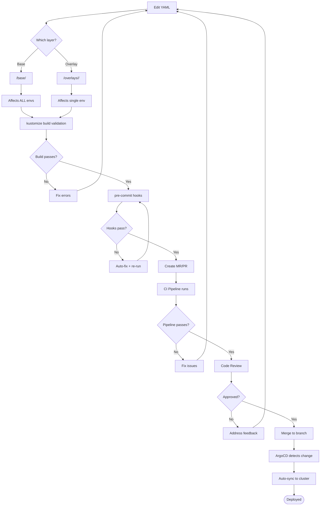
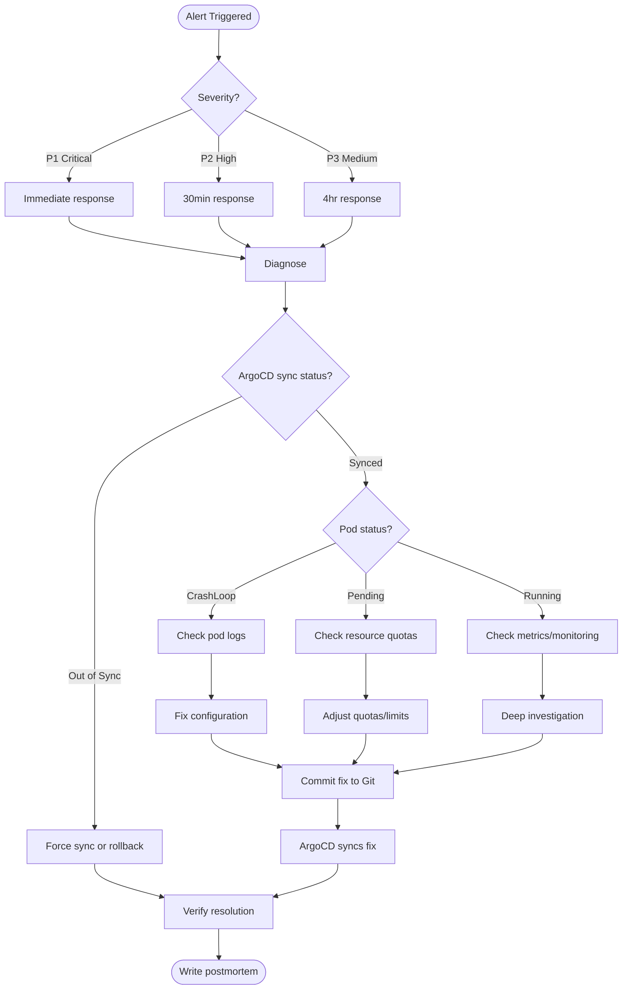
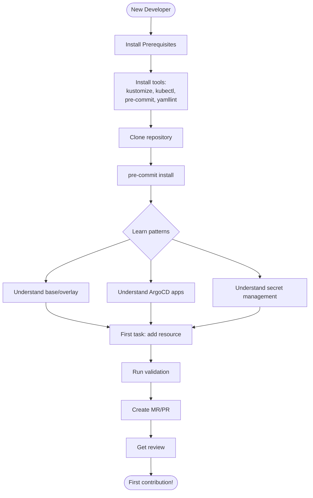
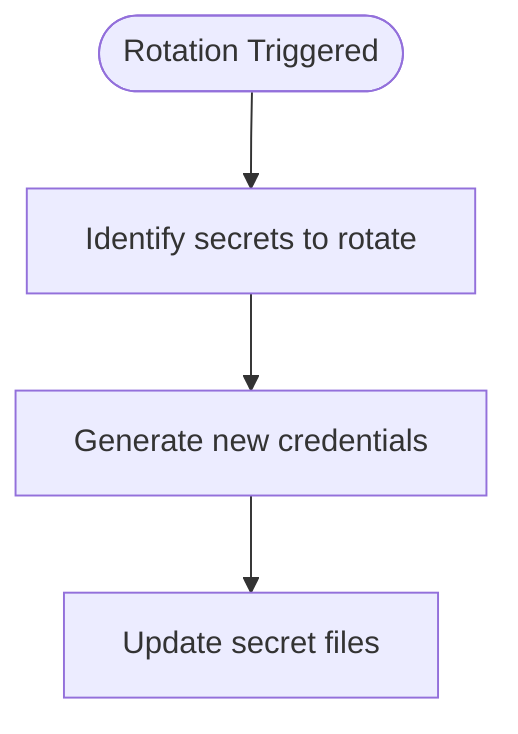

# flowchart — Workflow Flowchart Generation Skill

Generates workflow flowcharts for CI/CD pipelines, deployment processes, incident runbooks, and operational procedures using Mermaid.

## Usage

```
flowchart                  # All flowchart types
flowchart cicd             # CI/CD pipeline flow
flowchart deployment       # Deployment workflow
flowchart incident         # Incident response runbook
flowchart onboarding       # Developer onboarding flow
flowchart secret-rotation  # Secret rotation procedure
flowchart all              # Generate all types
```

## Arguments

$ARGUMENTS — Optional: flowchart type. Default: `all`.

## Instructions

### Step 0: Discover Repository Structure

- **Discover Kustomize modules** by finding directories that contain a `base/` and `overlays/` subdirectory structure
- **Discover environments** by listing subdirectories under each module's `overlays/` directory
- **Detect CI/CD config** by looking for `.gitlab-ci.yml`, `.github/workflows/`, `Jenkinsfile`, or similar CI configuration files
- Use discovered structure to build accurate, repo-specific flowcharts

### Type 1: CI/CD Pipeline Flow (`cicd`)

Parse the CI/CD configuration file (e.g., `.gitlab-ci.yml`, GitHub Actions workflows) and generate a flowchart of the pipeline:



Build stages and jobs dynamically from the actual CI config. Annotate each job with:
- `allow_failure` status
- Image used
- Trigger conditions

### Type 2: Deployment Workflow (`deployment`)

Look for deployment documentation (e.g., `docs/deployment-workflow.md`). If found, base the flowchart on it. Otherwise, generate a generic Kustomize + ArgoCD deployment flow:



### Type 3: Incident Response Runbook (`incident`)



### Type 4: Developer Onboarding Flow (`onboarding`)

Look for onboarding documentation (e.g., `docs/developer-onboarding.md`). If found, base the flowchart on it. Otherwise, generate a generic GitOps onboarding flow:



### Type 5: Secret Rotation Procedure (`secret-rotation`)

Generate dynamically using discovered environments:



Then for each discovered environment (in promotion order, e.g., dev -> stg -> prd):

```mermaid
    UPDATE_ENV --> ENV1[Update <env1> overlay]
    ENV1 --> TEST_ENV1[Validate <env1> build]
    TEST_ENV1 --> DEPLOY_ENV1[Deploy to <env1>]
    DEPLOY_ENV1 --> VERIFY_ENV1{<env1> working?}

    VERIFY_ENV1 -->|Yes| ENV2[Update <env2> overlay]
    VERIFY_ENV1 -->|No| ROLLBACK_ENV1[Rollback <env1>]
```

End with:
```mermaid
    VERIFY_LAST -->|Yes| REVOKE[Revoke old credentials]
    REVOKE --> DONE([Rotation complete])
```

### Output

Save all flowcharts to `docs/diagrams/`:
- `flowchart-cicd-pipeline.md`
- `flowchart-deployment-workflow.md`
- `flowchart-incident-runbook.md`
- `flowchart-onboarding.md`
- `flowchart-secret-rotation.md`

### Rendering (optional)

If `mmdc` is installed:
```bash
mmdc -i docs/diagrams/flowchart-cicd-pipeline.md -o docs/diagrams/flowchart-cicd-pipeline.png
```

If not installed, suggest: `npm install -g @mermaid-js/mermaid-cli`

### Graceful Degradation

- This skill generates Mermaid source files (plain text) and requires no external tools
- The `cicd` type reads CI config files -- if none are found, skip that flowchart and note which CI configs were searched for
- The `deployment` type reads deployment docs -- if missing, generate a generic deployment flow based on repo structure
- The `onboarding` type reads onboarding docs -- if missing, generate a generic onboarding flow based on repo structure
- If `mmdc` is not installed, skip PNG rendering -- the Mermaid source files render natively in GitLab/GitHub markdown

### Summary

```
Flowcharts Generated

| Flowchart | File | Rendered? |
|-----------|------|-----------|
| CI/CD Pipeline | docs/diagrams/flowchart-cicd-pipeline.md | PNG (if mmdc) |
| Deployment Workflow | docs/diagrams/flowchart-deployment-workflow.md | PNG (if mmdc) |
| Incident Runbook | docs/diagrams/flowchart-incident-runbook.md | PNG (if mmdc) |
| Onboarding | docs/diagrams/flowchart-onboarding.md | PNG (if mmdc) |
| Secret Rotation | docs/diagrams/flowchart-secret-rotation.md | PNG (if mmdc) |

All files use Mermaid syntax -- renders natively in GitLab/GitHub markdown.
```
