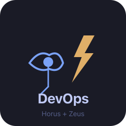
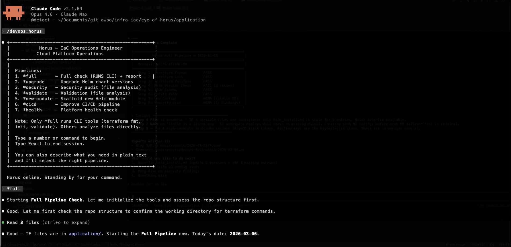
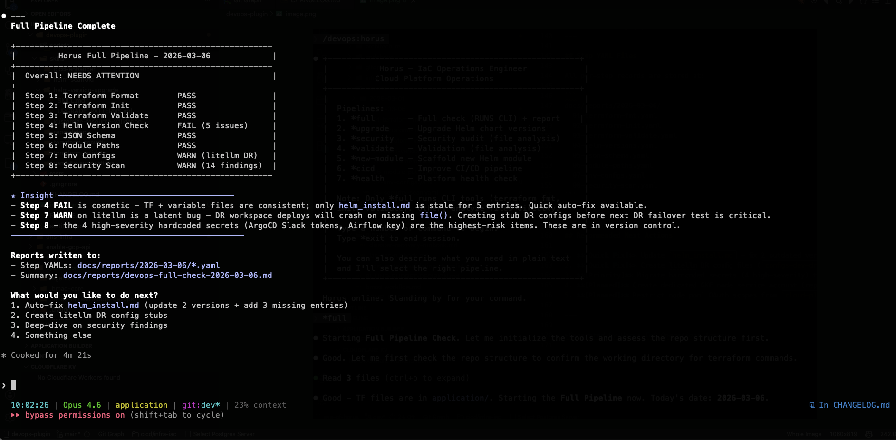
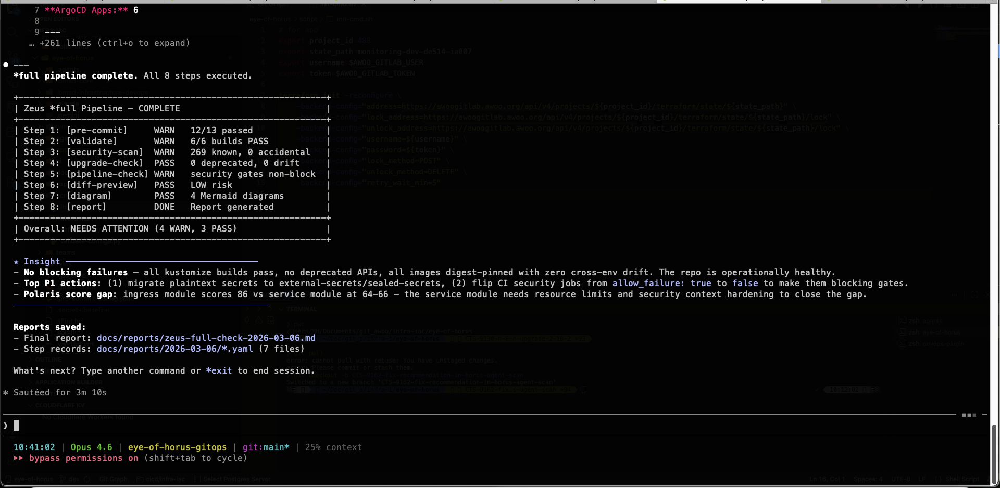

<p align="center">
  
</p>

# DevOps Plugin for Claude Code

[English](../README.md) | **繁體中文**

> 兩個 AI 驅動的 DevOps 代理 — **Horus**（IaC）和 **Zeus**（GitOps）— 提供 20+ 自動化流水線指令，支援 Terraform、Helm、Kustomize 和 ArgoCD。
>
> **跨平台支援：** 透過 [Agent Skills](https://agentskills.io/specification) 開放標準，支援 **Claude Code**、**OpenAI Codex CLI** 和 **Google Gemini CLI**。

## 快速開始

### 1. 安裝外掛

選擇你的 AI 編程助手對應的安裝方式：

<details open>
<summary><b>Claude Code</b>（推薦）</summary>

```bash
# 方式 A：透過 Marketplace 安裝（推薦）
/plugin marketplace add qwedsazxc78/devops-plugin
/plugin install devops@devops-go

# 方式 B：本地開發
git clone https://github.com/qwedsazxc78/devops-plugin.git
claude --plugin-dir ./devops-plugin
```

</details>

<details>
<summary><b>OpenAI Codex CLI</b></summary>

```bash
git clone https://github.com/qwedsazxc78/devops-plugin.git
cd devops-plugin && bash codex/setup.sh
# 建立 .agents/skills/ 符號連結 + 複製 AGENTS.md 到你的專案
```

設定完成後，使用自然語言與 Codex 互動：
```
codex "驗證所有 Terraform 程式碼"
codex "掃描 Helm chart 的安全漏洞"
```

</details>

<details>
<summary><b>Google Gemini CLI</b></summary>

```bash
git clone https://github.com/qwedsazxc78/devops-plugin.git
cd devops-plugin && bash gemini/setup.sh
# 建立 .gemini/skills/ 符號連結 + 複製 GEMINI.md 和 agent 檔案
```

設定完成後，使用自然語言與 Gemini 互動：
```
gemini "檢查 Kustomize manifests 是否可以合併"
gemini "掃描 Terraform 模組的安全問題"
```

</details>

<details>
<summary><b>跨平台（npx skills）</b></summary>

[`npx skills`](https://github.com/vercel-labs/skills) 自動偵測已安裝的 agent，將 skills 路由到正確目錄：

```bash
# 安裝所有 DevOps skills（同時支援 Claude、Codex 和 Gemini）
npx skills add qwedsazxc78/devops-plugin

# 僅安裝特定 skills
npx skills add qwedsazxc78/devops-plugin --skill terraform-validate
```

</details>

### 2. 更新至最新版本

```bash
# Git 更新
cd devops-plugin && git pull origin main

# 或透過 npx skills 更新
npx skills update

# 重新同步平台適配器（如有使用 Codex 或 Gemini）
bash codex/setup.sh    # Codex CLI
bash gemini/setup.sh   # Gemini CLI
```

### 3. 安裝必要工具

<details>
<summary><b>macOS</b></summary>

```bash
# 安裝 Homebrew（如尚未安裝）
/bin/bash -c "$(curl -fsSL https://raw.githubusercontent.com/Homebrew/install/HEAD/install.sh)"

# 基礎工具
brew install git kubectl jq yq

# GitOps (Zeus)
brew install kustomize kubeconform kube-score kube-linter trivy gitleaks
brew install FairwindsOps/tap/polaris FairwindsOps/tap/pluto conftest

# IaC (Horus)
brew install terraform tflint tfsec

# Python 工具（擇一）
uv tool install yamllint checkov pre-commit   # 快速 — 推薦
# 或: pip3 install yamllint checkov pre-commit
```

> **提示：** 安裝 [uv](https://docs.astral.sh/uv/) 以更快速管理 Python 工具：`curl -LsSf https://astral.sh/uv/install.sh | sh`

</details>

<details>
<summary><b>Linux (Debian/Ubuntu)</b></summary>

```bash
# 基礎工具
sudo apt-get update && sudo apt-get install -y git jq
sudo snap install kubectl --classic
sudo snap install kustomize yq

# Python 工具（擇一）
uv tool install yamllint checkov pre-commit   # 快速 — 推薦
# 或: pip3 install yamllint checkov pre-commit
```

</details>

<details>
<summary><b>Windows (WSL2)</b></summary>

```bash
# 1. 安裝 WSL2 搭配 Ubuntu（以管理員身分在 PowerShell 中執行）
wsl --install -d Ubuntu

# 2. 在 WSL2 中 — 透過 apt/snap 安裝基礎工具
sudo apt-get update && sudo apt-get install -y git jq
sudo snap install kubectl --classic
sudo snap install kustomize terraform --classic

# 3. Python 工具（擇一）
curl -LsSf https://astral.sh/uv/install.sh | sh  # 先安裝 uv
uv tool install yamllint checkov pre-commit        # 快速 — 推薦
# 或: pip3 install yamllint checkov pre-commit

# 4. 安裝 Homebrew for Linux（用於 apt/snap 未提供的工具）
/bin/bash -c "$(curl -fsSL https://raw.githubusercontent.com/Homebrew/install/HEAD/install.sh)"

# 5. 透過 Homebrew 安裝其餘工具
# GitOps (Zeus)
brew install kubeconform kube-score kube-linter trivy gitleaks
brew install FairwindsOps/tap/polaris FairwindsOps/tap/pluto conftest

# IaC (Horus)
brew install tflint tfsec
```

> **注意：** 如果 `snap` 無法使用（較舊的 WSL2 未啟用 systemd），請使用 Homebrew for Linux 安裝所有工具。

</details>

或使用互動式安裝腳本：

```bash
./scripts/install-tools.sh          # 互動式檢查 + 安裝
./scripts/install-tools.sh check    # 僅檢查
```

### 4. 檢查工具安裝狀態（Claude Code）

```
/devops:status              # 檢查所有工具 + 安裝缺少的
/devops:status horus        # 僅 IaC 工具
/devops:status zeus         # 僅 GitOps 工具
```

### 5. 偵測你的 Repo 類型（Claude Code）

```
/devops:detect
```

### 6. 啟動代理（Claude Code）

```
/devops:horus     # IaC Repo（Terraform + Helm + GKE）
/devops:zeus      # GitOps Repo（Kustomize + ArgoCD）
```

---

## 代理介紹

### Horus — IaC 維運工程師

荷魯斯之眼 — 基礎設施完整性的全能守護者。以流水線驅動、安全優先的方式管理 Terraform + Helm + GKE 平台。

| 流水線 | 用途 |
|--------|------|
| `*full` | 完整檢查 + YAML 步驟記錄 + Markdown 報告 |
| `*upgrade` | 升級 Helm Chart 版本（原子性三檔更新）|
| `*security` | 安全稽核（GKE + Helm + IAM）|
| `*validate` | 完整驗證（格式 + Schema + 一致性）|
| `*new-module` | 建立新的 Helm 模組 |
| `*cicd` | CI/CD 流水線改善 |
| `*health` | 平台健康儀表板 |

### Zeus — GitOps 工程師

Kustomize + ArgoCD 工作流程的流水線協調器。驗證、安全掃描、腳手架和視覺化。

| 流水線 | 用途 |
|--------|------|
| `*full` | 完整流水線 + YAML/MD 報告 |
| `*pre-merge` | 合併前必要檢查 |
| `*health-check` | Repository 健康評估 |
| `*review` | MR 審查流水線 |
| `*onboard` | 服務上線引導（互動式）|
| `*diagram` | 產生架構圖 |
| `*status` | 工具安裝狀態檢查 |

---

## 使用範例

### Horus（IaC）— 完整流水線檢查

啟動 Horus 並執行 `*full` 流水線，進行完整的基礎設施健康檢查：



`*full` 流水線執行 10 個步驟（探索 + terraform CLI + 檔案分析），產出包含可行動洞察的儀表板：



```
  Full Pipeline Complete

  +-----------------------------------------------------+
  |         Horus Full Pipeline — 2026-03-06             |
  +-----------------------------------------------------+
  |  Overall: NEEDS ATTENTION                            |
  +-----------------------------------------------------+
  |  Step 1: Terraform Format        PASS                |
  |  Step 2: Terraform Init          PASS                |
  |  Step 3: Terraform Validate      PASS                |
  |  Step 4: Helm Version Check      FAIL (5 issues)     |
  |  Step 5: JSON Schema             PASS                |
  |  Step 6: Module Paths            PASS                |
  |  Step 7: Env Configs             WARN (litellm DR)   |
  |  Step 8: Security Scan           WARN (14 findings)  |
  +-----------------------------------------------------+

  ★ Insight ─────────────────────────────────────
  - Step 4 FAIL 是表面問題 — TF + variable 檔案一致，
    僅 helm_install.md 過期 5 筆。可快速自動修復。
  - Step 7 WARN litellm 是潛在 Bug — DR 部署會因缺少
    設定檔而崩潰。在下次 DR 演練前建立 stub 設定檔至關重要。
  - Step 8 — 4 個高嚴重性硬編碼密鑰（ArgoCD Slack token、
    Airflow key）是最高風險項目，目前存在於版本控制中。
  ─────────────────────────────────────────────────

  報告輸出至：
  - 步驟 YAML：docs/reports/2026-03-06/*.yaml
  - 摘要報告：docs/reports/devops-horus-full-check-2026-03-06.md

  接下來要做什麼？
  1. 自動修復 helm_install.md（更新 2 個版本 + 補上 3 筆缺失）
  2. 建立 litellm DR 設定檔 stub
  3. 深入檢視安全掃描結果
  4. 其他
```

> 範例報告：[`docs/examples/devops-horus-full-check-2026-03-06.md`](examples/devops-horus-full-check-2026-03-06.md)

### Zeus（GitOps）— 完整流水線檢查

啟動 Zeus 並執行 `*full` 流水線，進行完整的 GitOps Repository 驗證：



`*full` 流水線探索模組與環境、檢查工具可用性，然後執行 7 個步驟（pre-commit、驗證、安全掃描、升級檢查、流水線稽核、差異預覽、架構圖）並產出完整報告。

> 範例報告：[`docs/examples/devops-zeus-full-check-2026-03-06.md`](examples/devops-zeus-full-check-2026-03-06.md)

---

## 指令一覽

### 快速上手

| 指令 | 說明 |
|------|------|
| `/devops:detect` | 掃描 Repo 判斷 IaC 或 GitOps 類型，推薦對應代理 |
| `/devops:status` | 檢查工具安裝狀態 + 安裝缺少的工具 |

### Zeus 指令（GitOps）

| 指令 | 說明 |
|------|------|
| `/devops:lint` | 快速 YAML 檢查 + kustomize build |
| `/devops:validate` | 完整驗證（7 個工具）|
| `/devops:security-scan` | 多工具安全掃描 |
| `/devops:secret-audit` | Secret 盤點 + 硬編碼偵測 |
| `/devops:diff-preview` | 分支差異 + 風險評估 |
| `/devops:upgrade-check` | 棄用 API + 映像版本漂移 |
| `/devops:pipeline-check` | CI/CD 流水線稽核 |
| `/devops:pre-commit` | 執行所有 Pre-commit Hooks |
| `/devops:k8s-compat` | Kubernetes 版本相容性檢查 |
| `/devops:add-service` | 建立新服務腳手架 |
| `/devops:add-ingress` | 建立 Ingress 資源 |
| `/devops:argocd-app` | 建立/驗證 ArgoCD Application |
| `/devops:diagram` | 架構圖（Mermaid/D2）|
| `/devops:flowchart` | 工作流程圖 |

### Horus 指令（IaC）

| 指令 | 說明 |
|------|------|
| `/devops:tf-validate` | Terraform 格式 + 驗證 + 一致性檢查 |
| `/devops:tf-security` | Terraform 安全稽核 |
| `/devops:helm-upgrade` | Helm Chart 版本升級 |
| `/devops:helm-scaffold` | 建立新的 Helm 模組腳手架 |
| `/devops:cicd-check` | CI/CD 流水線分析 |

### 自動觸發技能

這些會自動啟動 — 無需手動觸發：

| 技能 | 觸發條件 |
|------|----------|
| yaml-fix-suggestions | 編輯 Kustomize 目錄下的 YAML 檔案 |
| kustomize-resource-validation | 編輯 `kustomization.yaml` |
| repo-detect | 外掛載入 / 選擇代理時 |

---

## 文件說明

`docs/` 目錄包含以下詳細指南：

| 檔案 | 說明 |
|------|------|
| [`runbook.md`](runbook.md) | 完整操作手冊：安裝、工具設定、代理參考、指令參考、常見工作流程、故障排除 |
| [`use-cases.md`](use-cases.md) | 17 個實際使用案例與自然語言範例（中英對照） |
| [`cloud-integrations-roadmap.md`](cloud-integrations-roadmap.md) | 雲端整合藍圖：AWS EKS、Azure AKS、GCP 增強、成本最佳化等（中英對照） |
| [`cross-platform-migration-plan.md`](cross-platform-migration-plan.md) | 跨平台遷移計劃：Claude Code + Codex + Gemini CLI 支援、版本升級策略（中英對照） |
| [`README.zh-TW.md`](README.zh-TW.md) | 繁體中文文件（本檔案）|
| [`examples/devops-horus-full-check-2026-03-06.md`](examples/devops-horus-full-check-2026-03-06.md) | 範例：Horus `*full` 流水線報告 |
| [`examples/devops-zeus-full-check-2026-03-06.md`](examples/devops-zeus-full-check-2026-03-06.md) | 範例：Zeus `*full` 流水線報告 |

---

## 工具需求

### 必要工具

| 工具 | 代理 | 安裝方式 |
|------|------|----------|
| `git` | 共用 | `brew install git` / `apt install git` |
| `kubectl` | 共用 | `brew install kubectl` |
| `kustomize` | Zeus | `brew install kustomize` |
| `terraform` | Horus | `brew install terraform` |

### 建議工具

| 工具 | 代理 | 安裝方式 |
|------|------|----------|
| `yamllint` | Zeus | `pip3 install yamllint` |
| `kubeconform` | Zeus | `brew install kubeconform` |
| `kube-score` | Zeus | `brew install kube-score` |
| `checkov` | 兩者 | `pip3 install checkov` |
| `trivy` | Zeus | `brew install trivy` |
| `gitleaks` | Zeus | `brew install gitleaks` |
| `tflint` | Horus | `brew install tflint` |
| `tfsec` | Horus | `brew install tfsec` |
| `pre-commit` | Horus | `pip3 install pre-commit` |

**注意：** 所有技能在建議工具缺失時會優雅降級 — 跳過該檢查並顯示安裝指令。僅必要工具會阻斷執行。

---

## 跨平台支援

本外掛使用 [Agent Skills](https://agentskills.io/specification) 開放標準。所有 8 個 skills 在以下平台原生運作：

| 平台 | Skills | Agents | 指令 |
|------|--------|--------|------|
| **Claude Code** | 原生（SKILL.md） | 原生（`agents/*.md`） | `/devops:*` 斜線指令 |
| **OpenAI Codex CLI** | 原生（`.agents/skills/`） | 透過 `AGENTS.md` 路由 | 自然語言 |
| **Google Gemini CLI** | 原生（`.gemini/skills/`） | 透過 `GEMINI.md` 路由 | 自然語言 |

詳細的跨平台設定說明，請參閱 [`cross-platform-migration-plan.md`](cross-platform-migration-plan.md)。

---

## 設計原則

- **動態探索** — 模組和環境在執行時動態發現，無硬編碼路徑
- **可移植性** — 適用於任何符合預期模式的 Repo
- **跨平台** — 同一套 Skills 可在 Claude Code、Codex CLI 和 Gemini CLI 上運作
- **安全優先** — 套用前必先驗證，部署前必先掃描
- **優雅降級** — 缺少工具時跳過並顯示安裝建議

## 授權

MIT
