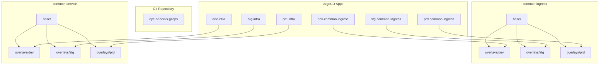
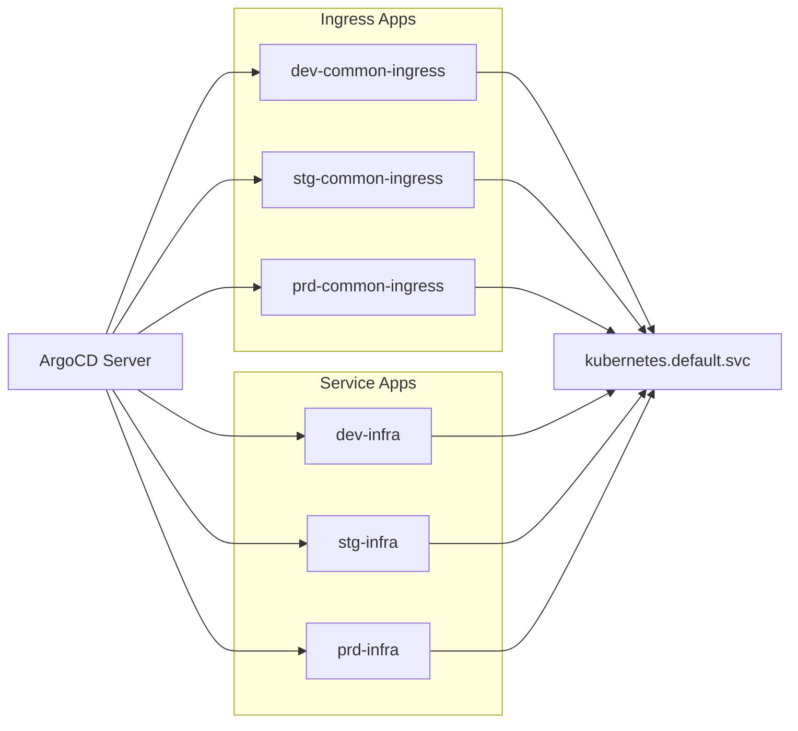
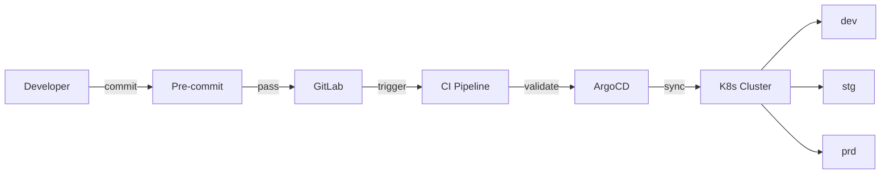

# Zeus Full Pipeline Report

**Date:** 2026-03-06
**Branch:** main
**Modules:** common.ingress, common.service
**Environments:** dev, stg, prd
**ArgoCD Apps:** 6

---

## Pipeline Summary

| Step | Check | Status | Gate |
|------|-------|--------|------|
| 1 | Pre-commit Hooks | WARN | Continue |
| 2 | Validation | WARN | Continue (builds PASS) |
| 3 | Security Scan | WARN | Continue (no accidental leaks) |
| 4 | Upgrade Check | PASS | Clear |
| 5 | Pipeline Check | WARN | Continue |
| 6 | Diff Preview | PASS | Informational |
| 7 | Diagrams | PASS | Complete |

**Overall: NEEDS ATTENTION** — No blocking failures. 4 warnings require remediation planning.

---

## Failed / Warning Checks

### Security Scan (WARN)

**Gitleaks: 269 findings** — All are intentional K8s Secret manifests and `.env` files, not accidental leaks.

| Finding Type | Count |
|-------------|-------|
| generic-api-key | 137 |
| private-key | 40 |
| slack-webhook-url | 25 |
| kubernetes-secret-yaml | 19 |
| gitlab-runner-auth-token | 19 |
| jwt | 18 |
| openai-api-key | 10 |
| gitlab-rrt | 1 |

**Trivy: 13 HIGH, 0 CRITICAL**
- KSV-0014: `readOnlyRootFilesystem` not set on ingress-nginx-controller and over-provisioning containers
- KSV-0118: Default security context allowing root privileges

**Kube-score:** 21-24 critical checks per overlay (missing network policies, resource limits, security hardening)

**Polaris:** 21-24 failed checks per overlay (missing priority classes, replica counts, security contexts)

**Recommendation:**
1. Migrate plaintext secrets to `external-secrets` or `sealed-secrets`
2. Set `readOnlyRootFilesystem: true` on ingress-nginx-controller
3. Add network policies for all namespaces
4. Review kube-score critical checks for quick wins

### Validation (WARN)

**Kustomize Builds: 6/6 PASS**

| Tool | Summary |
|------|---------|
| kube-score | 84 critical, 3 warning across 6 overlays |
| kube-linter | 36 errors (resource limits, PDB config, job TTL) |
| polaris | Scores: ingress=86, service=64-66 |
| trivy | 13 HIGH (readOnlyRootFilesystem, security context) |
| pluto | 0 deprecated APIs |
| kubeconform | SKIPPED (`brew install kubeconform`) |
| conftest | SKIPPED (no policy/ directory) |

**Top kube-linter issues:**
- `no-read-only-root-fs` on ingress-nginx-controller
- `pdb-unhealthy-pod-eviction-policy` missing on PDBs
- `job-ttl-seconds-after-finished` missing on admission Jobs
- `unset-cpu-requirements` on admission Jobs and nginx-deployment
- `pdb-min-available` >= replica count on service PDBs

### Pre-commit (WARN)

12/13 hooks passed. `trailing-whitespace` auto-fixed 1 file (`docs/reports/2026-03-01/gitops-full-2026-03-01.md`). Re-run passes clean.

### Pipeline Check (WARN)

**CI/CD: 3-stage pipeline (security → validate → test)**

| Issue | Severity |
|-------|----------|
| Security jobs have `allow_failure: true` | HIGH |
| Missing: kube-score, kube-linter, polaris in CI | MEDIUM |
| Missing: deploy notification stage | LOW |
| Missing: pluto deprecated-API detection | LOW |
| Missing: diff-preview in MR comments | LOW |

**Pre-commit: 13 hooks configured, versions current**

Missing recommended hooks: `kubeconform`, `kube-linter`, `polaris`, `conftest`

---

## Passed Checks

Upgrade Check (PASS)

- **Deprecated APIs:** 0 found
- **Removed APIs:** 0 found
- **Images:** 2 unique, all digest-pinned
  - `registry.k8s.io/ingress-nginx/controller:v1.12.1@sha256:d2fbc4...`
  - `registry.k8s.io/ingress-nginx/kube-webhook-certgen:v1.5.2@sha256:e88259...`
- **Cross-env drift:** None
- **K8s target version:** 1.28.0

Diff Preview (PASS)

- **Branch:** main
- **Uncommitted:** 1 modified (trailing whitespace fix), 1 untracked (`build-plugin.md`)
- **Last 5 commits:** 93 files changed (72 docs, 20 config, 1 manifest)
- **Risk level:** LOW — docs/tooling changes only

Diagrams (PASS)

4 Mermaid diagrams generated:
1. Module Dependency Graph
2. Kustomize Overlay Tree
3. ArgoCD Application Topology
4. Deployment Flow

Key observations:
- All 6 ArgoCD apps target in-cluster (`kubernetes.default.svc`)
- Automated sync with `prune: true` + `selfHeal: true`
- Ingress apps → `argocd` namespace; service apps → multi-namespace

---

## Architecture Diagrams

### Module Dependency Graph

### ArgoCD Topology

### Deployment Flow

---

## Tool Status

| Tool | Status | Version |
|------|--------|---------|
| kustomize | OK | v5.8.1 |
| kubectl | OK | v1.32.7 |
| git | OK | 2.46.2 |
| kube-score | OK | 1.20.0 |
| kube-linter | OK | 0.8.2 |
| gitleaks | OK | 8.30.0 |
| trivy | OK | 0.69.1 |
| polaris | OK | 10.1.4 |
| pluto | OK | 5.22.7 |
| conftest | OK | dev |
| pre-commit | OK | 4.4.0 |
| kubeconform | MISSING | — | `brew install kubeconform` |
| yamllint | MISSING | — | `pip install yamllint` |
| checkov | MISSING | — | `pip install checkov` |
| d2 | MISSING | — | `brew install d2` |

---

## Remediation Priorities

| Priority | Action | Impact |
|----------|--------|--------|
| P1 | Migrate secrets to external-secrets/sealed-secrets | Eliminates 269 gitleaks findings |
| P1 | Set security CI jobs to `allow_failure: false` | Makes security gates blocking |
| P2 | Add `readOnlyRootFilesystem: true` to ingress-nginx | Resolves 13 Trivy HIGH + kube-linter findings |
| P2 | Add CPU/memory requests+limits to admission Jobs | Resolves kube-linter + kube-score findings |
| P3 | Add network policies | Resolves kube-score critical checks |
| P3 | Set `unhealthyPodEvictionPolicy` on PDBs | Resolves kube-linter PDB warnings |
| P3 | Add kube-score + kube-linter to CI pipeline | Improves best-practice enforcement |
| P4 | Install missing tools (kubeconform, yamllint, checkov, d2) | Enables full validation suite |

---

## Step Records

All per-step YAML records: `docs/reports/2026-03-06/`

| File | Step |
|------|------|
| `01-pre-commit.yaml` | Pre-commit hooks |
| `02-validate.yaml` | Full validation |
| `03-security-scan.yaml` | Security scan |
| `04-upgrade-check.yaml` | Upgrade check |
| `05-pipeline-check.yaml` | Pipeline audit |
| `06-diff-preview.yaml` | Diff preview |
| `07-diagram.yaml` | Diagrams |

---

*Generated by Zeus — GitOps Engineer Pipeline Orchestrator*
*Report: `docs/reports/zeus-full-check-2026-03-06.md`*
